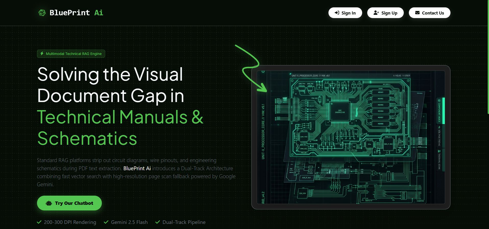
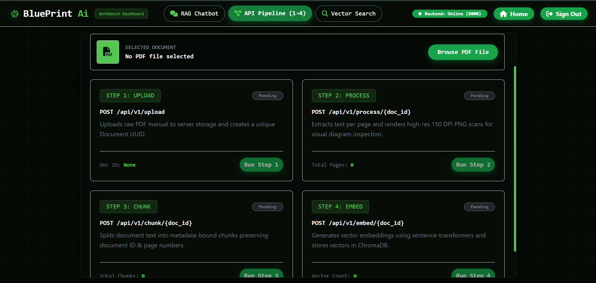
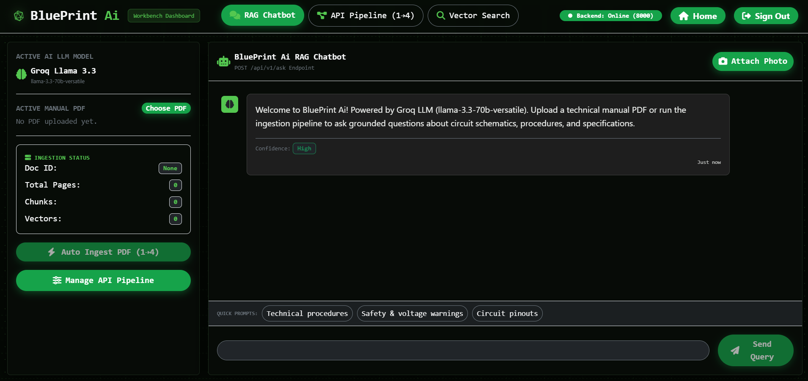
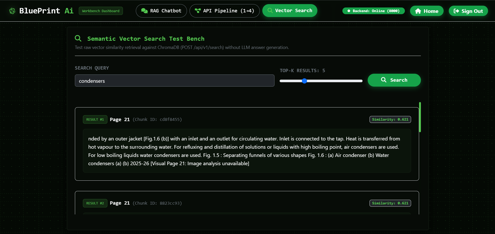

# 📐 BluePrint Ai — Technical Manual Retrieval & Multimodal RAG Platform

> **Enterprise-Grade Grounded Documentation Assistant for Technical Manuals, Schematics, & Engineering Procedures.**

---

## 📌 Executive Summary

### 🔴 The Problem
In industrial engineering, aviation, electronics, and technical operations, personnel spend up to **30% of their working hours searching through massive 100+ page technical manuals**, circuit schematics, pinout diagrams, and maintenance procedures. 

Traditional documentation search methods suffer from two critical flaws:
1. **Keyword Search Inflexibility**: Standard search requires exact string matches and fails to understand natural language semantic intent (e.g., searching *"how to fix cooling fan failure"* misses *"thermo-regulator fan troubleshooting"*).
2. **Generative AI Hallucinations**: Standard chatbots frequently fabricate procedural steps, wire colors, or torque specifications when context is missing. In technical environments, ungrounded AI answers pose severe operational and safety risks.

### 🟢 The Solution
**BluePrint Ai** solves this by establishing a **deterministic, zero-hallucination Technical Manual Retrieval & Multimodal RAG Platform**:
- **Grounded Text Retrieval (Groq + Llama-3.3-70b)**: Answers technical queries exclusively using retrieved manual chunks bound to exact page numbers and document IDs.
- **Multimodal Visual Diagram Analysis (Google Gemini 2.5 Flash)**: Parses uploaded circuit diagrams, pinout schematics, flowcharts, and component photos alongside technical questions.
- **Automated 4-Step Ingestion Pipeline**: Extracts raw text, renders 150 DPI high-resolution page scans, generates metadata-bound chunks, and indexes 384-dimensional dense vector embeddings into ChromaDB.
- **Interactive Dark Workbench UI**: Next.js 14 dashboard featuring real-time ingestion status tracking, vector search test bench, grounded evidence inspector, and dark blueprint aesthetics.

---

## 🚀 Key Features

- **Automated 4-Step Ingestion Pipeline**:
  1. **Upload**: Validates MIME type, checks size limits (50MB), generates unique Document UUID.
  2. **Process**: Extracts page text and renders high-res 150 DPI PNG scans per page for diagram inspection.
  3. **Chunk**: Splits manual text into metadata-bound chunks preserving `document_id`, `page_number`, and token counts.
  4. **Embed**: Generates 384-dimensional dense vector embeddings using `sentence-transformers/all-MiniLM-L6-v2` and indexes into persistent ChromaDB storage.
- **Hybrid Dual-LLM Intelligence**:
  - **Groq LLM (`llama-3.3-70b-versatile`)**: Ultra-low latency procedural text synthesis strictly constrained to retrieved evidence.
  - **Google Gemini API (`gemini-2.5-flash`)**: Multi-page schematic image reasoning and visual component identification.
- **Grounded Evidence Inspector**: Interactive modal allowing users to inspect exact source page chunks, similarity scores, and document metadata for every answer.
- **Strict Context Guardrails (`RetrievalFilter` & `PromptBuilder`)**:
  - **Similarity Thresholding**: Default `0.45` similarity cutoff preventing irrelevant context injection.
  - **Top-K Limiting**: Retrieves Top-5 candidate chunks per question.
  - **Deduplication & Character Capping**: Removes duplicate text blocks and enforces a `12,000` context character ceiling.
  - **Soft-Threshold Fallback**: Gracefully relaxes threshold when evidence is sparse, flagging low-confidence answers without bypassing deduplication or capping.
- **Vector Search Test Bench**: Direct API query interface against ChromaDB to evaluate raw vector similarity search results without LLM synthesis.
- **Enterprise Dark Workbench UI**: Built with Next.js 14, featuring live ingestion metrics, dotted matrix blueprint styling, high-contrast status badges (Red/Green/Blue), and button micro-animations.

---

## 🖼️ Laptop Device Screenshots Gallery

*Place your 4 landscape laptop screenshots in `./docs/screenshots/` with the filenames indicated below.*

<br/>

<div align="center" style="padding: 12px; margin-bottom: 28px;">

### 1. RAG Chatbot Workbench Dashboard
*Landscape screenshot of the main chat workbench interface showing pitch-black blueprint matrix theme (`#040904`), grounded answer output, page citations, rounded search bar, and sidebar ingestion metrics.*

<br/>



</div>

<br/>

<div align="center" style="padding: 12px; margin-bottom: 28px;">

### 2. Technical Manual Ingestion Pipeline (Steps 1–4)
*Landscape screenshot of the API pipeline controls showing real-time step cards for Upload (Step 1), Process (Step 2), Chunk (Step 3), and Embed (Step 4) with high-contrast status badges.*

<br/>



</div>

<br/>

<div align="center" style="padding: 12px; margin-bottom: 28px;">

### 3. Grounded Evidence Inspector Modal
*Landscape screenshot of the evidence inspector modal displaying exact page-cited manual chunks, similarity scores, document metadata, and circuit diagram preview.*

<br/>



</div>

<br/>

<div align="center" style="padding: 12px; margin-bottom: 28px;">

### 4. Semantic Vector Search Test Bench
*Landscape screenshot of the vector search test bench showing query inputs, Top-K result slider, similarity score badges, and ChromaDB vector chunk responses.*

<br/>



</div>


---

## 💻 How to Run the Project Locally

Follow these quick commands to start both the FastAPI backend and Next.js frontend on your local system.

### 1. Prerequisites Checklist
- **Python**: `3.11` or higher installed
- **Node.js**: `18.x` or higher installed
- **API Keys**: Groq API Key & Google Gemini API Key

---

### 2. Backend Terminal Commands

Open your first terminal window in the root directory:

#### **Windows (PowerShell)**
```powershell
# 1. Create and activate virtual environment
python -m venv .venv
.\.venv\Scripts\Activate.ps1

# 2. Install backend dependencies
pip install --upgrade pip
pip install -r requirements.txt

# 3. Create .env file if not created yet
cp .env.example .env

# 4. Start FastAPI Uvicorn backend server
uvicorn backend.main:app --reload --host 127.0.0.1 --port 8000
```

#### **macOS / Linux (Bash/Zsh)**
```bash
# 1. Create and activate virtual environment
python3 -m venv .venv
source .venv/bin/activate

# 2. Install backend dependencies
pip install --upgrade pip
pip install -r requirements.txt

# 3. Create .env file if not created yet
cp .env.example .env

# 4. Start FastAPI Uvicorn backend server
uvicorn backend.main:app --reload --host 127.0.0.1 --port 8000
```

---

### 3. Frontend Terminal Commands

Open a **second terminal window** in the root directory:

```bash
# 1. Navigate to frontend directory
cd frontend

# 2. Install Node packages
npm install

# 3. Start Next.js development server
npm run dev
```

---

### 4. Open in Web Browser

Once both terminal servers are running, access the local environments:

| Service | Access URL | Description |
| :--- | :--- | :--- |
| **Workbench Dashboard** | [`http://localhost:3000`](http://localhost:3000) | Primary Next.js user interface |
| **Backend API Base** | [`http://127.0.0.1:8000`](http://127.0.0.1:8000) | FastAPI application server |
| **Interactive API Docs** | [`http://127.0.0.1:8000/docs`](http://127.0.0.1:8000/docs) | Swagger OpenAPI interactive testing documentation |

---

## 🏗️ System Architecture

```text
┌────────────────────────────────────────────────────────────────────────────────────────┐
│                               NEXT.JS 14 WORKBENCH UI                                  │
│   ┌─────────────────────┐    ┌─────────────────────────┐    ┌──────────────────────┐   │
│   │ 💬 RAG Chatbot Tab  │    │ ⚙️ API Pipeline Tab (1-4)│    │ 🔍 Vector Search Tab │   │
│   └──────────┬──────────┘    └────────────┬────────────┘    └──────────┬───────────┘   │
└──────────────┼────────────────────────────┼────────────────────────────┼───────────────┘
               │ HTTP POST /api/v1/ask      │ HTTP POST Pipeline Steps   │ HTTP POST /api/v1/search
               ▼                            ▼                            ▼
┌────────────────────────────────────────────────────────────────────────────────────────┐
│                                FASTAPI BACKEND (v1)                                    │
│                                                                                        │
│   ┌────────────────────────────────────────────────────────────────────────────────┐   │
│   │                                 RAGService                                     │   │
│   └──────┬──────────────────┬──────────────────────┬──────────────────────┬────────┘   │
│          │                  │                      │                      │            │
│          ▼                  ▼                      ▼                      ▼            │
│   ┌──────────────┐  ┌───────────────┐     ┌────────────────┐    ┌──────────────────┐   │
│   │  Query Engine│  │Search Service │     │ RetrievalFilter│    │  PromptBuilder   │   │
│   │ (Understanding) │ (ChromaDB Vector)   │ (Top-5, Cap,   │    │(Grounding System │   │
│   └──────────────┘  └───────┬───────┘     │ Deduplication) │    │     Prompt)      │   │
│                             │             └────────────────┘    └─────────┬────────┘   │
└─────────────────────────────┼─────────────────────────────────────────────┼────────────┘
                              │                                             │
                              ▼                                             ▼
                 ┌─────────────────────────┐                   ┌─────────────────────────┐
                 │        ChromaDB         │                   │    Groq / Gemini LLM    │
                 │ 384d Dense Vector Store │                   │  (Answer Synthesis)     │
                 └─────────────────────────┘                   └─────────────────────────┘
```

---

## 🛠️ Technology Stack

| Layer | Component | Technology / Library |
| :--- | :--- | :--- |
| **Frontend UI** | Framework | **Next.js 14** (React 18, App Router) |
| | UI & Layout | **React-Bootstrap 5** + Custom Vanilla CSS (`globals.css`) |
| | Iconography | **FontAwesome 6** + Custom SVG Brand Assets |
| | HTTP Client | Native Browser **`fetch` API** |
| **Backend API** | Language & Runtime | **Python 3.11+ / 3.14** |
| | Framework | **FastAPI** (Asynchronous REST API) |
| | Server | **Uvicorn** (ASGI Application Server) |
| | Validation | **Pydantic v2** |
| **AI / RAG** | Text LLM | **Groq API (`llama-3.3-70b-versatile`)** |
| | Vision LLM | **Google Gemini API (`gemini-2.5-flash`)** |
| | Embeddings | **`sentence-transformers/all-MiniLM-L6-v2`** (384d) |
| **Storage & Data** | Vector DB | **ChromaDB** (Persistent vector similarity engine) |
| | PDF Processing | **PyMuPDF (`fitz`)** (High-res PNG rendering & text extraction) |
| | File Storage | Local Disk (`storage/manuals/`, `storage/page_images/`, `storage/metadata/`) |
| **Testing** | Suite | **Pytest** + **Pytest-Asyncio** + FastAPI **`TestClient`** (96 Unit Tests, 100% Pass) |

---

## ⚙️ Detailed Installation & Setup Guide

### 📋 Prerequisites
Ensure you have the following installed on your machine:
- **Python**: `3.11` or higher
- **Node.js**: `18.x` or higher (with `npm`)
- **Git**: Installed and configured

---

### Step 1: Clone the Repository
```bash
git clone https://github.com/Rohit-01-afk/HexaFalls_Test.git
cd HexaFalls_Test
```

---

### Step 2: Configure Environment Variables
Create a `.env` file in the root directory by copying `.env.example`:
```bash
cp .env.example .env
```

Edit `.env` and add your API keys:
```env
# Groq API Key (Obtain from https://console.groq.com)
GROQ_API_KEY="your_groq_api_key_here"

# Gemini API Key (Obtain from https://aistudio.google.com)
GEMINI_API_KEY="your_gemini_api_key_here"

# CORS Configuration
ALLOWED_ORIGINS="http://localhost:3000,http://127.0.0.1:3000,http://localhost:8000,http://127.0.0.1:8000"
```

---

### Step 3: Backend Setup & Server Startup

1. **Create and Activate Python Virtual Environment**:
   - **Windows (PowerShell)**:
     ```powershell
     python -m venv .venv
     .\.venv\Scripts\Activate.ps1
     ```
   - **Linux / macOS**:
     ```bash
     python3 -m venv .venv
     source .venv/bin/activate
     ```

2. **Install Python Dependencies**:
   ```bash
   pip install --upgrade pip
   pip install -r requirements.txt
   ```

3. **Start the FastAPI Backend Server**:
   ```bash
   uvicorn backend.main:app --reload --host 127.0.0.1 --port 8000
   ```
   *The backend server will run at `http://127.0.0.1:8000`.*
   *Interactive OpenAPI docs are accessible at `http://127.0.0.1:8000/docs`.*

---

### Step 4: Frontend Setup & Dashboard Startup

1. Open a **new terminal tab/window** and navigate to the `frontend` directory:
   ```bash
   cd frontend
   ```

2. **Install Node Dependencies**:
   ```bash
   npm install
   ```

3. **Start the Next.js Development Server**:
   ```bash
   npm run dev
   ```
   *The workbench dashboard will open at `http://localhost:3000`.*

---

### Step 5: End-to-End Workflow Verification

1. Open `http://localhost:3000` in your web browser.
2. Navigate to the **API Pipeline** tab (Tab 2).
3. Click **Browse PDF File** and select any technical PDF manual.
4. Click **Run Full Pipeline** to execute all 4 steps automatically:
   - **Step 1 (Upload)** ➔ Assigns Document UUID.
   - **Step 2 (Process)** ➔ Renders 150 DPI page scans & extracts raw text.
   - **Step 3 (Chunk)** ➔ Generates text chunks with token metadata.
   - **Step 4 (Embed)** ➔ Generates 384d embeddings & indexes into ChromaDB.
5. Switch to the **RAG Chatbot** tab (Tab 1) and ask a question!
6. Click **Inspect Source Evidence** on any response to verify exact page-cited chunks.

---

## 📡 REST API Reference

| Endpoint | Method | Description | Request Payload | Response Schema |
| :--- | :--- | :--- | :--- | :--- |
| `/health` | `GET` | System health status & database connectivity | None | `{"status": "ok"}` |
| `/api/v1/upload` | `POST` | Upload PDF manual | `multipart/form-data` (`file`) | `UploadResponse` |
| `/api/v1/process/{doc_id}` | `POST` | Process PDF (extract text & render scans) | Path parameter `doc_id` | `ProcessResponse` |
| `/api/v1/chunk/{doc_id}` | `POST` | Split manual into metadata-bound chunks | Path parameter `doc_id` | `ChunkGenerationResponse` |
| `/api/v1/embed/{doc_id}` | `POST` | Generate embeddings & index into ChromaDB | Path parameter `doc_id` | `EmbeddingResponse` |
| `/api/v1/search` | `POST` | Raw vector similarity search against ChromaDB | `{"query": "...", "top_k": 5}` | `SearchResponse` |
| `/api/v1/ask` | `POST` | Grounded RAG question answering pipeline | `{"query": "...", "document_id": "..."}` | `AskResponse` |

---

## 🧪 Automated Testing Suite

The repository features a **100% passing automated test suite** covering all core modules, engines, and API endpoints using `pytest`.

To run the full test suite:
```bash
# Ensure virtual environment is activated
pytest
```

### Test Coverage Summary (96 Passed)
- `tests/unit/test_chunking.py`: Chunk generation & overlap validation
- `tests/unit/test_context_selector.py`: Context window selection & character caps
- `tests/unit/test_embedding.py`: Vector embeddings & ChromaDB indexing
- `tests/unit/test_gemini_service.py`: Multimodal diagram analysis
- `tests/unit/test_groq_service.py`: LLM answer generation & fallback handling
- `tests/unit/test_pdf_processing.py`: PyMuPDF text extraction & PNG rendering
- `tests/unit/test_prompt_builder.py`: Grounded prompt formatting & deduplication
- `tests/unit/test_rag.py`: End-to-end RAG service pipeline integration
- `tests/unit/test_retrieval_filter.py`: Similarity thresholding, Top-5 capping & soft-threshold logic
- `tests/unit/test_search.py`: Vector search API endpoints
- `tests/unit/test_upload.py`: PDF validation, MIME checking & file security

---

## 📁 Repository Directory Structure

```text
HexaFalls_Test/
├── backend/
│   ├── api/v1/
│   │   ├── endpoints/       # FastAPI REST endpoints (upload, process, chunk, embed, search, ask, health)
│   │   └── router.py        # API Router aggregator
│   ├── core/
│   │   ├── config.py        # Settings & environment variables
│   │   └── logging.py       # Centralized logger
│   ├── models/              # Internal domain models
│   ├── schemas/             # Pydantic request/response schemas
│   ├── services/            # Core business logic services
│   │   ├── upload_service.py
│   │   ├── pdf_processing_service.py
│   │   ├── chunking_service.py
│   │   ├── embedding_service.py
│   │   ├── search_service.py
│   │   ├── retrieval_filter.py
│   │   ├── prompt_builder.py
│   │   ├── groq_service.py
│   │   ├── gemini_service.py
│   │   └── rag_service.py
│   └── main.py              # FastAPI application entrypoint & CORS middleware
├── frontend/
│   ├── app/
│   │   ├── globals.css      # Dark blueprint theme design system & animations
│   │   ├── layout.js
│   │   └── page.js
│   ├── components/
│   │   ├── RedesignedDashboard.jsx  # Primary Workbench UI
│   │   └── ...
│   └── package.json
├── storage/                 # Local disk storage (git-ignored)
│   ├── manuals/
│   ├── page_images/
│   ├── metadata/
│   └── chromadb/
├── tests/
│   └── unit/                # Pytest unit & integration test suite (96 tests)
├── .env.example
├── requirements.txt
└── README.md
```

---

## 📜 License & Compliance

Developed strictly adhering to **Clean Architecture** principles and enterprise security guardrails. All document processing happens locally or via encrypted native SDK calls. No proprietary document text is logged or stored externally.
